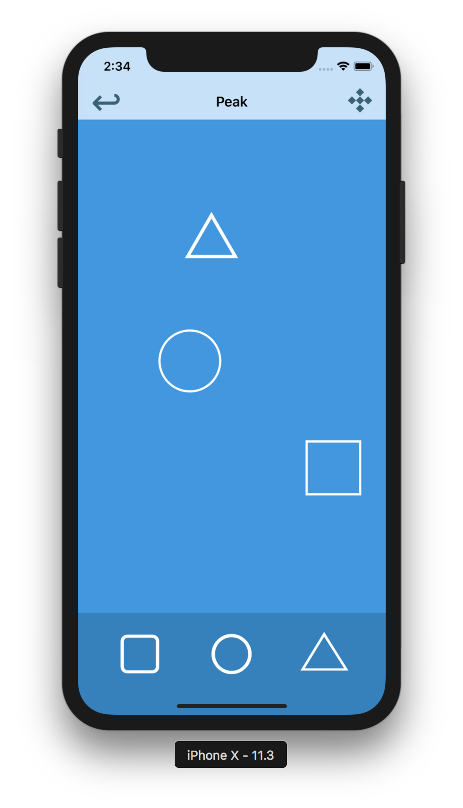

# # Swift Draggable Shapes

original source: https://github.com/priteshdesai/Swift-Draggable-Shapes

new modifications will be as follows: 

1. snap to grid will be added (TODO)
2. shape will now be UIView instead of UILabel
3. more gestureRecognizers will be implemented

This is a simple app that allows users to drag and drop shapes onto a canvas and play with it. 

1. There are 3 buttons (square, circle, and triangle). Each time you tap on a button: an object of that shape will be created, and displayed in a random position on screen. 
2. You can move the shape by dragging it 
around the screen. 
3. There is also an “Undo” button. Each time you press undo it will cancel the last action performed; which will be either the creation or the movement of a shape object. 
4. You can also check “Stats” of the shapes on the screen.

One interesting thing I learned while building this app was how to copy a view. You cannot simply copy a view because it is an instance of a class. However you can use NSKeyedArchiver and Unarchiver to do so.

